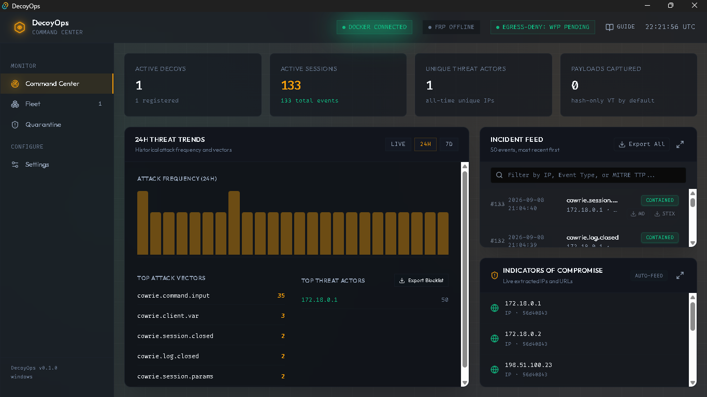
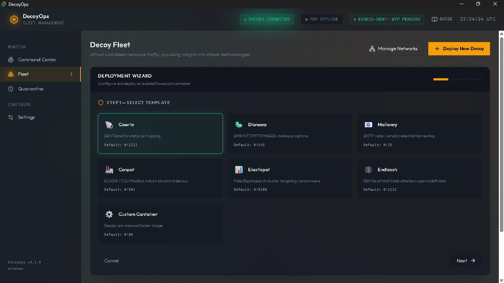

# DecoyOps

[](https://github.com/MR-05-001/decoyops/actions)
[](https://opensource.org/licenses/MIT)
[](https://tauri.app/)
[](#)

> **DecoyOps** is a zero-trust, air-gapped desktop application for deploying, managing, and monitoring Docker-based network honeypots. Built on a Tauri 2.0 (Rust) backend and a React (TypeScript) frontend, it gives a single operator a real-time command center for observing attacker behavior safely, without exposing the host or requiring any paid infrastructure.

This is a personal research/learning project, actively evolving. See [Project Status](#8-project-status--known-limitations) before relying on any specific claim below.

---

## Screenshots

**Command Center** — live incident feed, 24h threat trends, and auto-extracted indicators of compromise:



**Deployment Wizard** — one-click deploy across six honeypot templates, plus custom containers:



> Screenshots show test/lab traffic (local Docker bridge and RFC 5737 test-range IPs), not live internet exposure. Tunnel URLs and container IDs are redacted before publishing, since even ephemeral ngrok endpoints shouldn't be shared unnecessarily.

---

## 1. Architecture Stack

| Layer | Technology | Purpose |
| :--- | :--- | :--- |
| **Frontend** | React, TypeScript, TailwindCSS, custom SVG threat scope | UI rendering, live telemetry display |
| **Backend Core** | Rust (Tauri 2.0) | IPC bridge, Docker orchestration, firewall/tunnel management |
| **Containerization** | Docker CE | Honeypot orchestration via the Rust `bollard` client, held entirely behind `docker.rs` (never exposed to the frontend) |
| **Database** | SQLite | WAL mode, `busy_timeout=5000`, single-writer task pattern |
| **Telemetry** | `tokio` (async), `notify` (fs watching) | Event-driven log ingestion via MPSC channels |
| **Geolocation** | MaxMind GeoLite2 | Offline, zero-latency IP-to-location lookups |
| **Threat Intel** | AbuseIPDB, VirusTotal (free tiers) | Rate-limited, cached reputation/hash lookups |
| **Tunneling** | FRP (self-hosted) or ngrok | Selectable per-deployment; see [§3](#3-tunneling-frp-or-ngrok) |

---

## 2. Honeypot Templates

| Template | Emulates |
|---|---|
| **Cowrie** | SSH/Telnet bruteforce traps |
| **Dionaea** | Malware capture over SMB/HTTP/FTP, with JSON telemetry enabled |
| **Mailoney** | SMTP relay credential harvesting |
| **Conpot** | SCADA/ICS industrial control system emulation |
| **Elasticpot** | Vulnerable Elasticsearch instance |
| **Endlessh** | SSH tarpit — stalls attackers indefinitely |

---

## 3. Tunneling: FRP or ngrok

Each deployment can use either tunnel provider, selected per-decoy in Settings:

- **FRP (self-hosted)** — you run `frps` on your own VPS or server. All traffic stays on infrastructure you control. Requires a small always-on host (a free-tier VPS works; see the hardening doc for the honest tradeoffs of "free" hosting options).
- **ngrok** — no server to run; a public URL is issued automatically. Simpler for local/personal use. Traffic passes through ngrok's infrastructure, and free-tier URLs are **not stable across restarts**.

DecoyOps shows a non-blocking notice in Settings whenever ngrok is the active provider, since it's the one of the two that routes traffic through a third party rather than infrastructure you control.

---

## 4. Security Hardening Constraints

These are treated as hard constraints in the codebase (`AGENTS.md`), not aspirations — each is checked in the project's periodic internal audits:

1. **No direct Docker socket exposure.** Only `docker.rs` ever imports `bollard`; the frontend can only reach Docker through a small set of named Tauri commands.
2. **Captures are never executed.** Payloads get `chmod 000` (Unix) / read-only + hidden (Windows) and a `.isolated` suffix immediately on capture. VirusTotal submissions are hash-only by default.
3. **Egress-deny by default, per decoy.** Outbound traffic from each decoy's subnet is dropped by default — via `nftables` on Linux, and via `NetFirewallRule` (PowerShell) as a documented interim mechanism on Windows pending full WFP integration. See [§8](#8-project-status--known-limitations).
4. **Scoped Tauri IPC surface.** No `shell:allow-execute`. Filesystem write permissions are scoped to specific app-data paths, not left unbounded.
5. **Rate-limited, cached third-party lookups.** AbuseIPDB/VirusTotal calls go through a token-bucket limiter with 24h dedup caching, to stay inside free-tier quotas even under a real attack burst.
6. **Capability-dropped containers.** Decoys deploy with `cap-drop: ALL` by default; capabilities are added back only for the specific templates that demonstrably require them, documented per-template rather than granted broadly.
7. **Secrets never touch disk in plaintext.** API keys and tunnel auth tokens are stored exclusively via the OS keyring (Credential Manager / Keychain / Secret Service), never in SQLite, config files, or logs.

---

## 5. Installation & Setup

### Prerequisites
* **Node.js** (v20 or newer)
* **Rust** (Stable toolchain via `rustup`)
* **Docker CE**, running and accessible to your user context

**Linux only** — additional build tools:
```bash
sudo apt update
sudo apt install libwebkit2gtk-4.1-dev build-essential curl wget file libxdo-dev libssl-dev libayatana-appindicator3-dev librsvg2-dev
```

### Build Instructions

```bash
git clone https://github.com/MR-05-001/decoyops.git
cd decoyops
npm install
npm run tauri dev      # development mode
npm run tauri build    # production build → src-tauri/target/release/bundle/
```

---

## 6. Automated CI/CD

`.github/workflows/release.yml` builds Windows, macOS, and Linux installers automatically on any pushed `vX.Y.Z` tag and attaches them to a new GitHub Release.

---

## 7. Documentation

* `docs/blueprint-v2.md` — core specification and data models
* `docs/blueprint-v3-hardening.md` — firewall, tunneling, and capability-drop hardening details
* `AGENTS.md` — standing constraints and coding standards for anyone (human or AI agent) contributing to this codebase
* `DESIGN_SYSTEM.md` — UI design tokens and visual language

---

## 8. Project Status & Known Limitations

This project is under active development. Documenting known gaps here rather than letting the feature list overstate what's proven:

- **Windows egress-deny** uses a PowerShell `NetFirewallRule`-based stopgap, not a native Windows Filtering Platform (WFP) integration. It enforces the same outcome but is less deeply integrated; full WFP support is a planned hardening item.
- **In-process Docker access.** `docker.rs` connects to the Docker daemon in-process rather than through a separate `docker-socket-proxy` container. This is a deliberate v1 tradeoff for a single-operator desktop tool — it protects against webview-origin attacks but not a full compromise of the DecoyOps process itself. See `docs/blueprint-v3-hardening.md` for the reasoning and upgrade path.
- **Per-template capability requirements** (for `cap-drop ALL`) are being verified individually per honeypot template rather than assumed uniformly; check `AGENTS.md` for the current, template-by-template status.
- **ngrok free-tier URLs are not stable across restarts** — expected behavior, not a bug, for anyone relying on a consistent address.

---

## 9. Responsible Use

DecoyOps deploys intentionally vulnerable services and can expose them to the public internet. If you run it:

- Only deploy decoys on infrastructure and network ranges you own or are explicitly authorized to use.
- Be aware of your local laws regarding operating honeypots and handling captured malware — this varies by jurisdiction.
- Never execute or open captured payloads outside the built-in quarantine tooling.
- If you enable "C2 observation mode" (permitting limited egress from a decoy to observe callback behavior), understand that you are intentionally allowing outbound traffic from a compromised-by-design container — treat that data and any triggered outbound connections accordingly.

---

## 10. License

MIT License, with an additional security-research use notice. See [`LICENSE`](LICENSE) for full terms.
